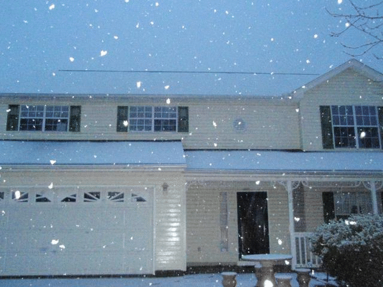
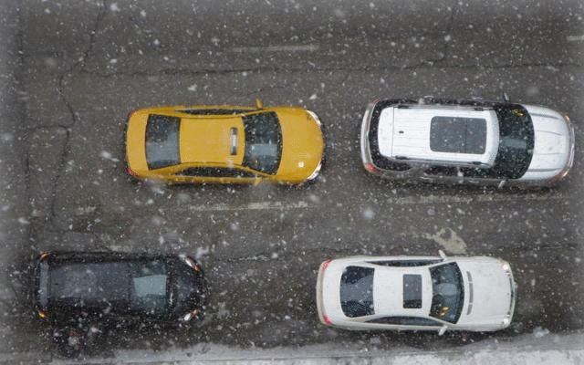
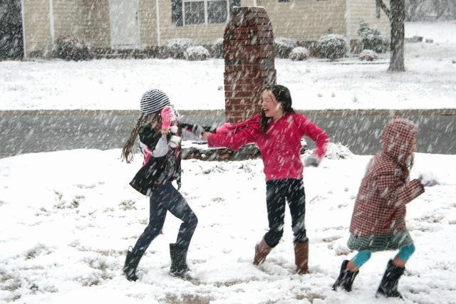
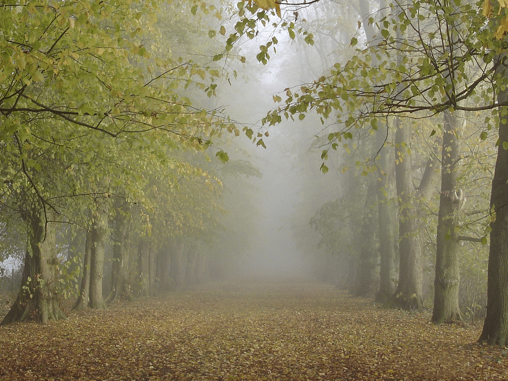
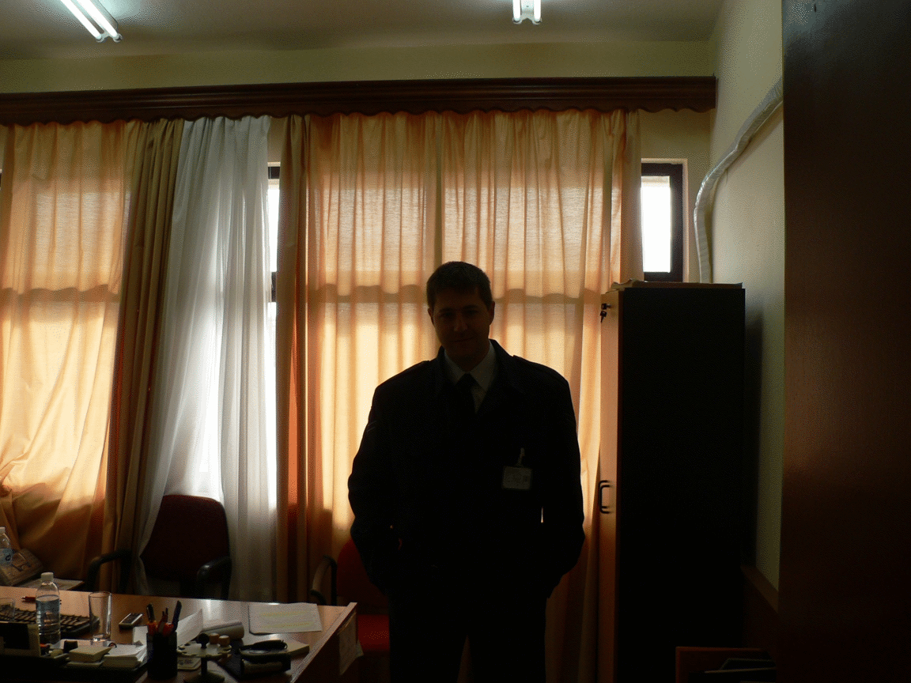

# Image Restoration:trumpet::trumpet::trumpet:

**Recent works on image restoration** :smile:

## Contents

* [Deraining](#deraining)
* [Desnowing](#desnowing)
* [Dehazing](#dehazing)
* [Low-light Enhancement](#low-light-enhancement)

## Deraining

    
   
       

    
On synthesized images   

    
  

    
  

    
On real-world images   

#### High-level vision tasks

Object detection results with/without deraining. The labels and corresponding confidences are both given by [Google Vision API](https://cloud.google.com/vision/). (*left: rainy inputs; right: deraining results*)

    

  
  
 

## Desnowing

    

  

    

  

    

  

[More desnowing results](./figs/desnow/)

## Dehazing

    

    

    

[More deshazing results](./figs/dehaze/)

## Low-light Enhancement

    

  

    

  

    

  

    

  

[More low-light enhancement results](./figs/lowlight/)