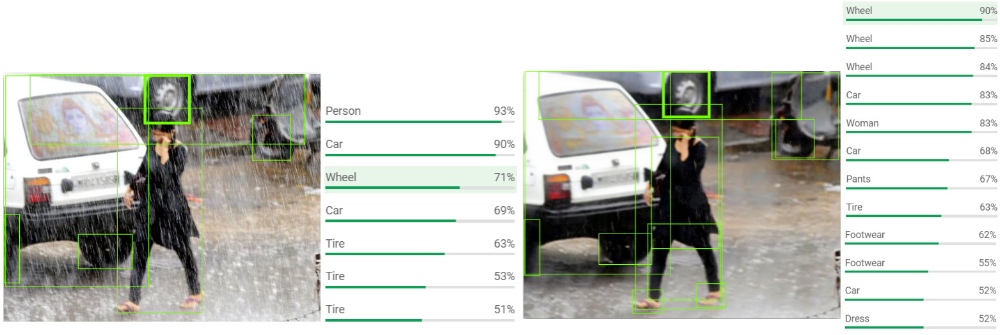
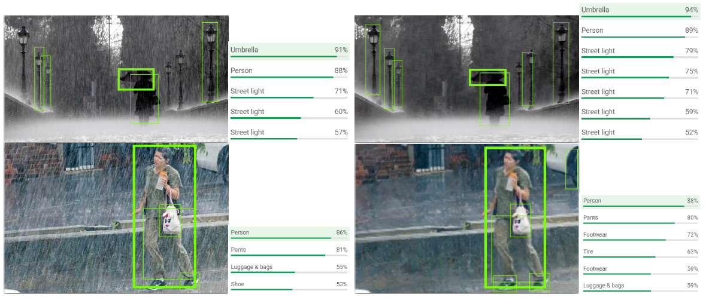
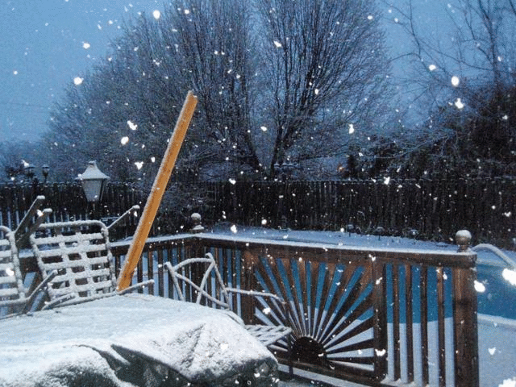
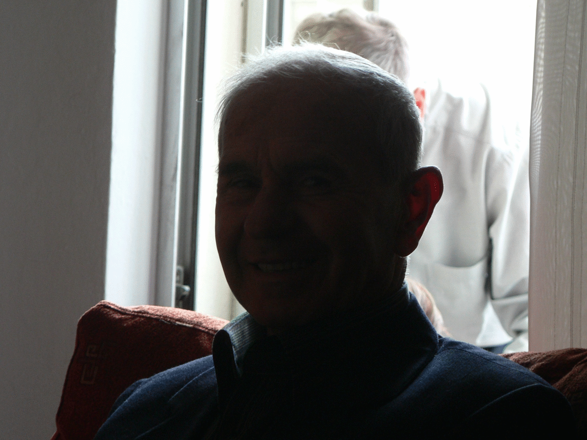
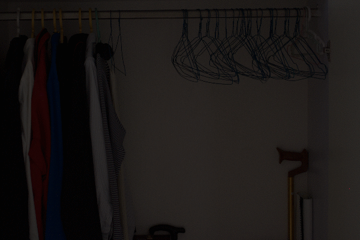

# Image Restoration:trumpet::trumpet::trumpet:

**Recent works on image restoration** :smile:

Including **high-quality image recovery (denoising, debluring and super-resolution)** with a event camera, and **image restoration (deraining, desnowing, dehazing, low-light enhancement)** in severe weather 

## Contents

* [EventCamera](#eventcamera)
* [Deraining](#deraining)
* [Desnowing](#desnowing)
* [Dehazing](#dehazing)
* [Low-light Enhancement](#low-light-enhancement)

## Event​C​a​m​e​ra:camera:

    
   
       

    
Without super-resolution on synthetic (top) and real data (bottom)

    
   
       

    
With super-resolution on synthetic (top) and real data (bottom)

    
         

    
High frame-rate video reconstruction 

<video id="video" controls="" preload="none"  poster="http://media.w3.org/2010/05/sintel/poster.png">
  <source id="mp4" src="figs/event/demo_video.mp4">
</video>

## Deraining:cloud_with_lightning_and_rain:

    
   
       

    
On synthesized images   

    
  

    
  

    
On real-world images   

#### High-level vision tasks

Object detection results with/without deraining. The labels and corresponding confidences are both given by [Google Vision API](https://cloud.google.com/vision/). (*left: rainy inputs; right: deraining results*)

    

  
  
 

## Desnowing:snowflake:

    

  

    

  

    

  

[More desnowing results](./figs/desnow/)

## Dehazing:fog:

    

    

    

[More deshazing results](./figs/dehaze/)

## Low-light Enhancement:high_brightness:

    

  

    

  

    

  

    

  

[More low-light enhancement results](./figs/lowlight/)